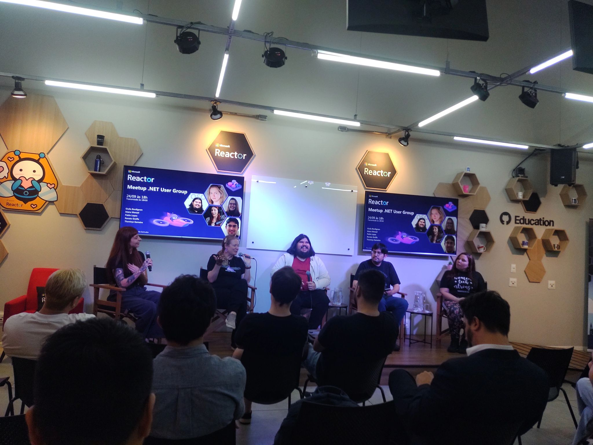
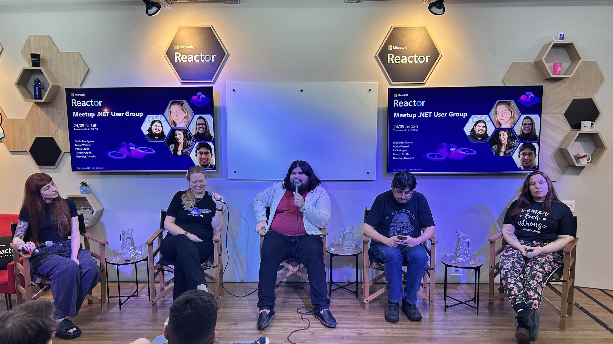
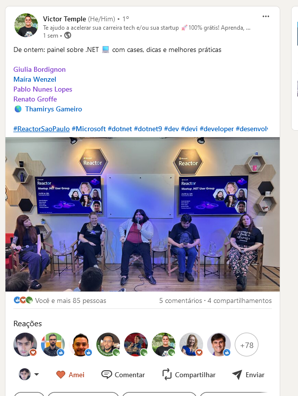
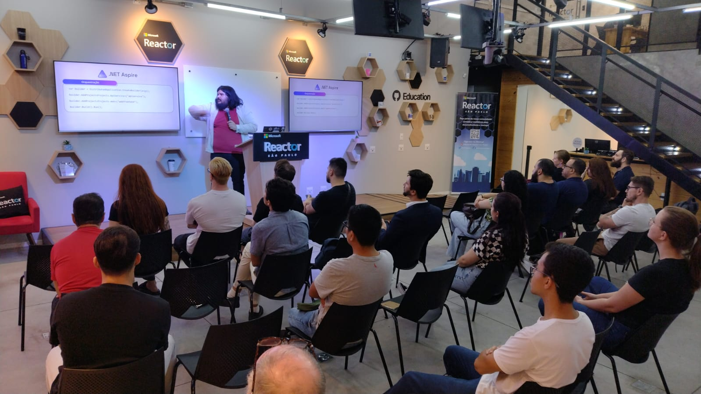
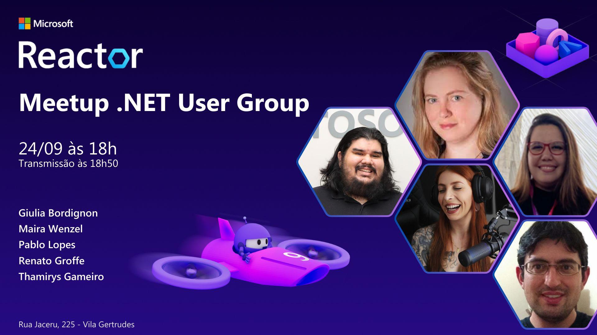

# DotNetUserGroup-2025-09
Fotos e informações gerais sobre minha participação no **Meetup: .NET user group São Paulo**, evento que aconteceu em **São Paulo-SP** no dia **24/09/2024 (terça-feira)**.

Recebi o convite para participar do:

**Painel sobre novos recursos do .NET 9, C# 13, ASP.NET Core...**

Technologies covered: **.NET 9, ASP.NET Core, C# 13, Visual Studio Code, Windows, Linux, OpenAPI, Azure...**

Em que participei ao lado do **Pablo Nunes Lopes (Cloud Advocate - Microsoft)**, da **Maíra Wenzel (Senior Program Manager - Microsoft)**, da **Thamirys Gameiro (Microsoft MVP)** e da **Giulia Bordignon**, abordando novidades na plataforma .NET.

Número de participantes: **20 pessoas**

Acesse este [**link**](/img/) para visualizar todas as fotos das apresentações.

Link da transmissão: [**YouTube**](https://www.youtube.com/watch?v=NjMg1rR7sJw)

Formulário utilizado para inscrições: [**Microsoft Reactor**](https://developer.microsoft.com/pt-br/reactor/events/23670/?wt.mc_id=3reg_23670_webpage_reactor)

Local: **Microsoft Reactor - Rua Jaceru, 225 - Vila Gertrudes - São Paulo - SP - CEP: 04705-000**

Agradeço novamente ao **Pablo Nunes Lopes**, ao **Victor Temple** e à **Larissa Cyganski** pela oportunidade e todo o apoio para que eu participasse de mais um evento no **Microsoft Reactor** em **São Paulo-SP**.

---

